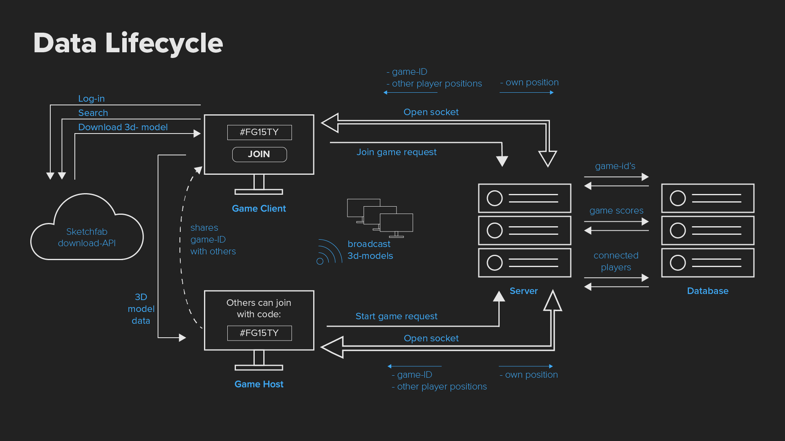

<!-- ### [Live Demo](https://anon-says-herokuapp.com) -->

# Multiplayer HTML5 webgl2

## Table of contents

- [Description](#description-)
- [To do](#to-do-)
- [Installing](#installing-)
- [Data Lifecycle Diagram](#data-lifecycle)
- [Packages & Services](#packages--services)
- [How it works](#how-it-works-)
- [Technologies Used](#technologies-used-)
  - [Websockets](#websockets)
  - [Express-ws](#express-ws)
- [Goals](#goals)
- [License](#license-)

## Description 📝
To experiment with real-time networking I wanted to create a multiplayer 3D game in the browser from scratch.
I do use the threeJS library to abstract the low-level webGL API.
The idea eventually is that users can create a room for which they will receive a room-key (Like Kahoot)
This room key will be saved and up to X amount of players can connect to the room.
All scores and some metadata will be saved on the database and session to persist the users.

## To Do 📌

- [x] A basic webGL game where you can walk around
- [ ] A websocket connection to the server to show other connected players
- [ ] Users can host their own games
- [ ] Server hosted 'rooms
- [ ] Player models from external API
- [ ] A functional game-mode

## Installing 🔍
To install this application follow these steps:

- `git clone https://github.com/aaraar/real-time-web-1920`
- `cd real-time-web-1920`
- `yarn` / `npm install`
- `yarn start`
  - Run `yarn watch` & `yarn dev` concurrently for development
  
## Data lifecycle

### Packages & Services

This project makes use of the following tech:

- [Node](https://nodejs.org/)
- [Express](https://expressjs.com/)
- [express-ws](https://github.com/HenningM/express-ws)
- [Three.js](https://threejs.org/)

## How It Works 🛠️

Core features of this project.

## Technologies Used 🖲

### Websockets

- When creating a multiplayer browsergame, websockets is the first thing you should think of.
  This technology is perfect for these kind of applications where data should be send and displayed almost instantly to all users.
  The websockets in this app makes sure the server has a live connection with all connected users and makes it able for the users to talk to eachother in real-time.

### express-ws

- For this project I wanted to make use of websockets without the socket.io package since it does a lot of (great) things in the background,
  that I want to learn or do for myself for once. The `express-ws` is still an abstraction layer over the native node `ws` package,
  this abstraction however is very small. It handles the link between the websocket and the http server, sends a status code on connection and
  implements a router that accepts human-readable strings instead of regular expressions. These are not the functionalities I want to focus on
  learning. - `express-ws`

## Goals

- _Websockets in JS without socket.io_
- _Sending and handling abstract data (canvas content)_
- _Deal with real-time complexity_
- _Handle real-time client-server interaction_
- _Handle real-time data management_
- _Handle multi-user support_

## License 🔓

MIT © [Bas de Greeuw](https://github.com/aaraar)

<!-- Add a link to your live demo in Github Pages 🌐-->

<!-- ☝️ replace this description with a description of your own work -->

<!-- replace the code in the /docs folder with your own, so you can showcase your work with GitHub Pages 🌍 -->

<!-- Add a nice image here at the end of the week, showing off your shiny frontend 📸 -->

<!-- Maybe a table of contents here? 📚 -->

<!-- How about a section that describes how to install this project? 🤓 -->

<!-- ...but how does one use this project? What are its features 🤔 -->

<!-- What external data source is featured in your project and what are its properties 🌠 -->

<!-- This would be a good place for your data life cycle ♻️-->

<!-- Maybe a checklist of done stuff and stuff still on your wishlist? ✅ -->

<!-- How about a license here? 📜  -->

[rubric]: https://docs.google.com/spreadsheets/d/e/2PACX-1vSd1I4ma8R5mtVMyrbp6PA2qEInWiOialK9Fr2orD3afUBqOyvTg_JaQZ6-P4YGURI-eA7PoHT8TRge/pubhtml
