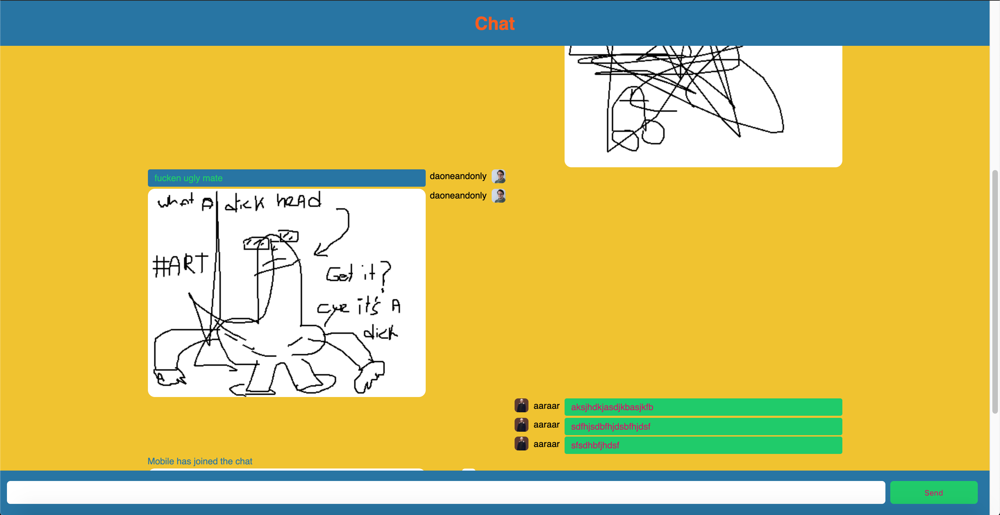

# [Live Demo](https://anon-says-herokuapp.com)
# Draw chat
As an excercise to practice with websockets I created a chat service that let's you choose a username and talk to each other.
All data is send over the wss protocol client-to-server and then server-to-client so it is completely anonymous.
There is an option to start drawing with `/draw` which streams HTML canvas data so all users can see your amazing drawings

## Packages
 - `express-ws`
    * For this project I wanted to make use of websockets without the socket.io package since it does a lot of (great) things in the background,
    that I want to learn or do for myself for once. The `express-ws` is still an abstraction layer over the native node `ws` package,
    this abstraction however is very small. It handles the link between the websocket and the http server, sends a status code on connection and
    implements a router that accepts human-readable strings instead of regular expressions. These are not the functionalities I want to focus on
    learning.

## Goals
- _Deal with real-time complexity_
- _Handle real-time client-server interaction_
- _Handle real-time data management_
- _Handle multi-user support_

<!-- Add a link to your live demo in Github Pages 🌐-->

<!-- ☝️ replace this description with a description of your own work -->

<!-- replace the code in the /docs folder with your own, so you can showcase your work with GitHub Pages 🌍 -->

<!-- Add a nice image here at the end of the week, showing off your shiny frontend 📸 -->

<!-- Maybe a table of contents here? 📚 -->

<!-- How about a section that describes how to install this project? 🤓 -->

<!-- ...but how does one use this project? What are its features 🤔 -->

<!-- What external data source is featured in your project and what are its properties 🌠 -->

<!-- This would be a good place for your data life cycle ♻️-->

<!-- Maybe a checklist of done stuff and stuff still on your wishlist? ✅ -->

<!-- How about a license here? 📜  -->

[rubric]: https://docs.google.com/spreadsheets/d/e/2PACX-1vSd1I4ma8R5mtVMyrbp6PA2qEInWiOialK9Fr2orD3afUBqOyvTg_JaQZ6-P4YGURI-eA7PoHT8TRge/pubhtml
